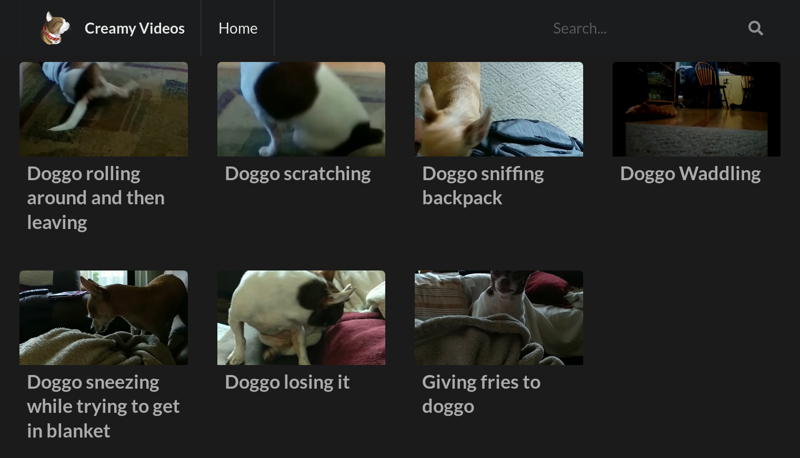

# Creamy Videos

<p align="center">
    
    <p align="center">The creamiest selfhosted tubesite</p>
    <p align="center">
        <a href="https://github.com/AlbinoDrought/creamy-videos/blob/master/LICENSE"></a>
    </p>
</p>

## Screenshots




## Building

### Without Docker

```
# install go deps
go get

# install templ for template generation
go install github.com/a-h/templ/cmd/templ@v0.2.334

# generate template changes
go generate ./...

# build single-file creamy-videos.exe
go build
```

### With Docker

`docker build -t ghcr.io/albinodrought/creamy-videos .`

## Usage

```
CREAMY_APP_URL="https://videos.r.albinodrought.com" \
CREAMY_VIDEO_DIR="/videos" \
CREAMY_HTTP_VIDEO_DIR="/static/videos/" \
CREAMY_HTTP_PORT=80 \
CREAMY_POSTGRES=true \
CREAMY_POSTGRES_USER=postgres \
CREAMY_POSTGRES_PASSWORD=postgres \
CREAMY_POSTGRES_DATABASE=postgres \
CREAMY_POSTGRES_ADDRESS=localhost:5432 \
./creamy-videos serve
```

- `CREAMY_APP_URL`: the externally-accessible URL this instance can be reached at, excluding trailing slash

- `CREAMY_VIDEO_DIR`: where to persist DummyVideoRepo data

- `CREAMY_HTTP_VIDEO_DIR`: where to serve persisted video data

- `CREAMY_HTTP_PORT`: port to listen on

- `CREAMY_POSTGRES`: if `true`, use Postgres instead of JSON store

- `CREAMY_POSTGRES_USER`: Postgres username, defaults to `postgres`

- `CREAMY_POSTGRES_PASSWORD`: Postgres password, defaults to `postgres`

- `CREAMY_POSTGRES_DATABASE`: Postgres database, defaults to `postgres`

- `CREAMY_POSTGRES_ADDRESS`: Postgres address including port, defaults to `localhost:5432`

- `CREAMY_READ_ONLY`: if `true`, set the API to read-only mode and disable non-read-only routes

- `CREAMY_XSRF_KEY_B64`: Base64-encoded key to use for generating XSRF tokens. If empty, a random one will be generated. It is recommended to set this value.

(all following commands require the same env configuration)

### Migrating data from JSON to Postgres

`./creamy-videos dejson`

### Regenerating video thumbnails

Regenerate all:

`./creamy-videos thumbnail -a`

Regenerate videos with IDs 3, 4, and 5:

`./creamy-videos thumbnail 3 4 5`

## See Also

- [creamy-videos-importer](https://github.com/AlbinoDrought/creamy-videos-importer) for easily importing videos into your creamy-videos instance
